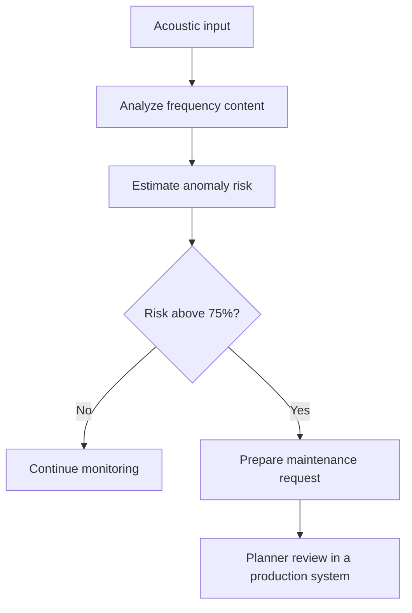
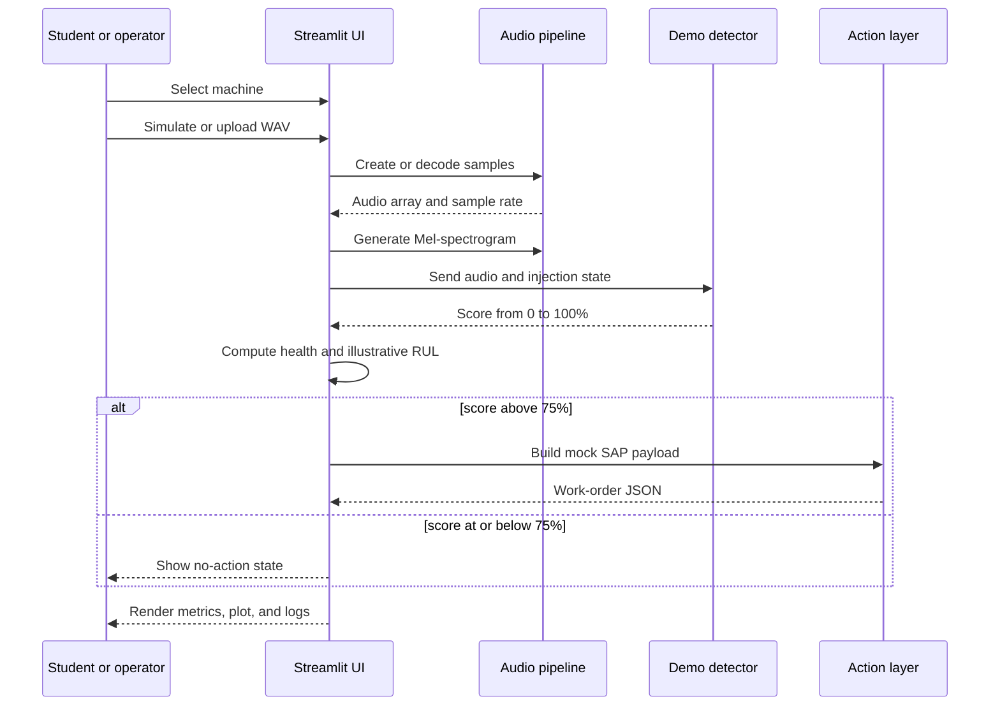

# Application documentation: Acoustic Diagnostic Agent

This page is the central reference for operating and studying the application. It is written for engineering students, developers, and reviewers who want to understand the complete MVP in one place.

## 1. Application purpose

The application demonstrates a condition-monitoring loop:



The UI simulates a machine operator receiving acoustic evidence, seeing health metrics, and reviewing a proposed SAP S/4HANA maintenance action.

## 2. Application screen reference

### Sidebar

- **Machine** selects one of three profiles:
  - Robotic Arm Bearings
  - Stamping Press
  - Conveyor Drive
- **Inject Micro-Crack Anomaly** adds damped 22 kHz bursts to synthetic audio.
- **Upload acoustic sample** accepts a `.wav` file and decodes it with Librosa.
- **Simulate Acoustic Data** creates a new synthetic signal using the selected profile and toggle state.

### Metrics

- **Machine health status** is `HEALTHY`, `WARNING`, or `CRITICAL`.
- **Anomaly score** is a demo score from 0–100%.
- **Estimated RUL** is an illustrative remaining-useful-life value in days.

### Signal analysis

The Mel-spectrogram shows acoustic energy over time. The simulator uses a 48 kHz sample rate, which supports frequencies up to 24 kHz under the Nyquist limit. This allows the synthetic 22 kHz fault bursts to appear in the high-frequency range.

### Agentic response

When the score is greater than 75%, the UI displays:

1. signal-received log;
2. high-frequency-band isolation log;
3. micro-crack confirmation log;
4. threshold-exceeded log;
5. maintenance-request creation log;
6. mock SAP S/4HANA work-order JSON.

The work order includes a ticket ID, material part number, suggested maintenance window, priority, anomaly score, and target system.

## 3. Code reference

The application is intentionally implemented in one file, [`app.py`](../app.py).

| Function or section | Responsibility |
| --- | --- |
| `MACHINE_PROFILES` | Machine-specific frequencies, parts, RUL baselines, and descriptions |
| `inject_styles` | Applies the dark industrial dashboard theme |
| `generate_acoustic_data` | Builds sine-wave, harmonic, noise, and optional ultrasonic components |
| `calculate_anomaly` | Computes FFT high-band energy and a deterministic demo score |
| `health_for` | Maps score ranges to health states and UI colors |
| `render_spectrogram` | Creates and renders the Librosa/Matplotlib Mel-spectrogram |
| `sap_payload` | Creates the simulated SAP maintenance payload |
| Streamlit session state | Preserves the current audio array and sample rate between reruns |

## 4. End-to-end data flow



## 5. Technical concepts to study

### Sampling and Nyquist frequency

For sample rate `f_s`, the Nyquist frequency is:

```text
f_N = f_s / 2
48,000 / 2 = 24,000 Hz
```

The app uses 48 kHz so a 22 kHz component is representable. A lower-rate recording may lose or alias the fault signal.

### Time and frequency domains

The waveform describes amplitude over time. The FFT estimates how much energy exists at each frequency. Short bearing impacts may be hard to recognize from the waveform alone but become visible as high-frequency events in a spectrogram.

### Mel-spectrogram

The application converts a Mel-scaled power spectrogram to decibels for visualization. This is an explanatory plot; the detector currently uses FFT magnitude above 20 kHz directly.

### Rule-based anomaly score

The score is intentionally not a trained model. It uses:

```text
high_band_energy = mean(abs(rFFT(audio))[frequency > 20,000])
score = clip(base_score + scaled_energy + optional_demo_boost, 0, 100)
```

The optional demo boost makes the toggle produce a repeatable critical path for classroom demonstrations.

## 6. Recommended lab sequence

1. Run the healthy path and note all three metrics.
2. Enable anomaly injection and simulate again.
3. Compare the spectrograms and explain the high-frequency difference.
4. Change a machine `base_frequency` and observe the lower-frequency signature.
5. Change the threshold and discuss false-positive and false-negative trade-offs.
6. Replace the demo boost with measured features.
7. Add confidence, input validation, unit tests, and human approval.

## 7. Questions for review or assessment

- Why must the simulator use more than 40 kHz to represent a frequency above 20 kHz?
- Why can a spectrogram reveal information that an average spectrum hides?
- What makes a deterministic toggle useful for teaching but unsuitable as a production detector?
- Which additional features could separate bearing damage from load changes or ambient noise?
- Why should a real SAP write operation require authentication, audit logging, and a verified response?
- How would you split train/test data to avoid leaking recordings from the same asset across both sets?

## 8. Production-readiness boundary

This MVP does not provide a safety-certified diagnosis, a calibrated RUL forecast, or a real SAP integration. A production implementation would need validated sensor hardware, asset-specific data, labeled failure history, model monitoring, confidence gating, human approval, secure credentials, API retries, idempotency, audit trails, and rollback procedures.

For deeper study, continue with:

- [`architecture.md`](architecture.md) for system diagrams and production evolution;
- [`engineering-student-guide.md`](engineering-student-guide.md) for exercises and responsible-engineering guidance;
- [`README.md`](../README.md) for setup and deployment instructions.
