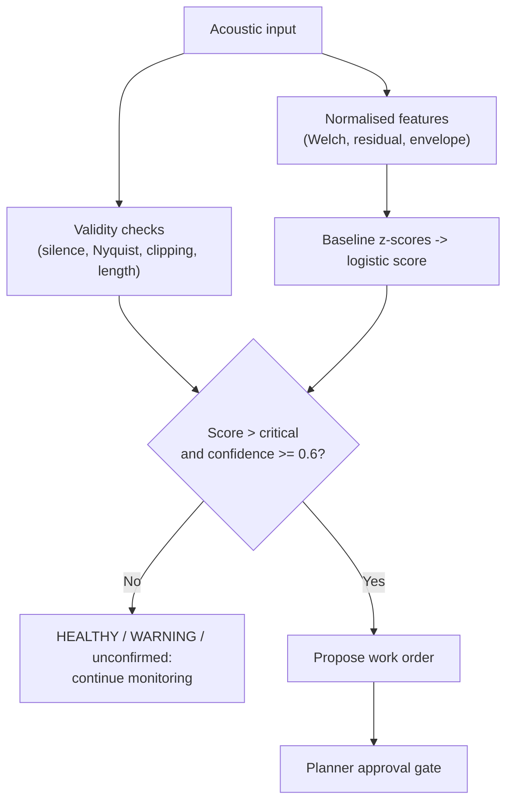
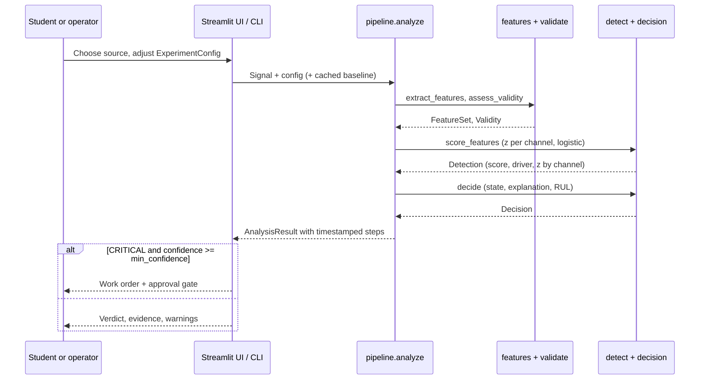

# Application documentation: Acoustic Diagnostic Agent

This page is the central reference for operating and studying the application (v0.2.0). It is
written for engineering students, developers and reviewers who want to understand the complete
system in one place.

## 1. Application purpose

The application demonstrates a condition-monitoring loop with honest measurement and gated action:



The UI simulates an operator receiving acoustic evidence, reading health metrics with their
supporting evidence, and reviewing a proposed SAP S/4HANA maintenance action.

## 2. Screen reference

### Sidebar: Source -> Configure -> Analyse

- **1 · Source** – *Simulate* (machine profile, fault toggles, seed, **Generate signal**),
  *Upload* (WAV/FLAC/OGG, multi-channel averaged to mono, 50 MB / 120 s limit) or
  *Sample library* (the 15 labelled files in `data/samples`, with their purpose shown).
- **2 · Configure** – sample rate, duration, noise level, burst amplitude, thresholds, teaching
  demo boost. Every value lives in one `ExperimentConfig`; advanced parameters are in the
  Experiment tab. The configuration hash is displayed so results can be traced.
- **3 · Analyse** – the current signal is scored automatically whenever the configuration changes.

### Monitor tab

- **Verdict banner** – state badge (`HEALTHY`, `WARNING`, `CRITICAL`, `CRITICAL (unconfirmed)`,
  `INVALID`) and confidence badge, plus a one-sentence explanation naming the strongest evidence.
- **Metrics** – anomaly score (with delta against the warn threshold), confidence, illustrative
  RUL, sample rate / duration.
- **Spectrogram** – linear-frequency STFT in dB with the diagnostic band shaded. Mel scaling was
  dropped because it compresses 20-24 kHz into a few bins.
- **Evidence channels** – horizontal bars of the weighted z-score per channel with the 50 %
  line; the driver is highlighted.
- **Detail plots** – PSD against the healthy baseline, envelope spectrum with the expected
  BPFO line, waveform with detected impulses.
- **Agent steps** – `st.status` timeline with real timestamps.
- **Work order** – mock SAP S/4HANA PM payload and a simulated planner-approval button, shown
  only for a confident CRITICAL verdict.
- **Export** – run-log CSV, result JSON, NPZ bundle, WAV, PNG plots, session approvals, persistent audit JSONL.

### Experiment tab

Advanced parameter form (bands, high-pass, Welch segment, envelope range, weights, std floors,
z-centre / scale), YAML/JSON import and export, custom baseline from uploaded healthy
recordings, one-parameter sweeps with fault/healthy score bands, and the session run log.

### Batch tab

Score the bundled sample library or an uploaded folder with an optional manifest. Shows a per-file
table, ROC AUC, average precision, precision/recall at the critical threshold, confusion counts and
ROC / PR curves. Unlabelled or invalid files are excluded from the metrics but kept in the table.

### History tab

SQLite-backed run history across sessions (path from `ACOUSTIC_AGENT_DATA_DIR`), per-asset score
trend with warn/critical guides, structured audit events (analyses + approvals), and CSV/JSONL
export. On ephemeral hosts the file is lost on restart unless a volume is mounted; downloads remain
the durable record.

### Methods tab

The scoring rule, channel table and glossary, rendered from the live configuration.

## 3. Code reference

The Streamlit file [`app.py`](../app.py) is a thin front-end. All logic is in the
[`acoustic_agent`](../acoustic_agent/) package and is exercised by the CLI and the tests.

| Module | Responsibility |
| --- | --- |
| `config` | `MachineProfile`, `ExperimentConfig` (validation, YAML/JSON, `config_hash`), default weights and std floors |
| `synth` | Deterministic synthetic signals: tonal base, ultrasonic bursts, bearing impacts, healthy references |
| `features` | Welch PSD, band power / contrast, time-resolved band contrast, high-pass residual, kurtosis, crest factor, Hilbert envelope spectrum, impulse detection |
| `validate` | Silence, short capture, band above Nyquist, clipping -> `Validity(valid, confidence, warnings, flags)` |
| `detect` | `Baseline` calibration, per-channel z-scores with floors, weighted max, logistic score |
| `decision` | Health state, explanation, recommended action, illustrative RUL, mock work-order payload |
| `pipeline` | `analyze`, `run_batch`, `sweep` – the only entry points the UI and CLI call |
| `metrics` | ROC / PR curves, AUC, precision / recall / F1 (NumPy only) |
| `io` | Audio decoding with limits, WAV export, sample manifest, CSV / NPZ helpers |
| `store` | SQLite run history and structured audit log (`ACOUSTIC_AGENT_DATA_DIR`) |
| `plots` | Matplotlib PNGs with a shared theme |
| `cli` | `acoustic-agent analyze | batch | sweep | config | calibrate | history | audit` |

## 4. End-to-end data flow



## 5. Method

### Features (all gain- and length-invariant)

| Channel | Definition | Fires on |
| --- | --- | --- |
| `band_contrast_db` | Welch PSD in the diagnostic band (20-24 kHz) relative to the 14-18 kHz reference band | Narrow-band ultrasonic content; ≈ 0 dB for white noise of any level |
| `band_contrast_transient_db` | 98th percentile minus median of the same contrast computed per ~20 ms STFT frame | Short bursts that whole-capture averaging dilutes, e.g. under heavy noise |
| `band_power_db` | Diagnostic band relative to total power | Any high-frequency energy including broadband noise – weight 0 by default, shown for teaching |
| `residual_kurtosis` | Kurtosis of the residual high-passed above 2 kHz (Gaussian = 3) | Repetitive impacts |
| `residual_crest_factor` | Peak / RMS of the residual | Isolated impulses |
| `envelope_peak_snr_db` | Prominence of the strongest line in the Hilbert-envelope spectrum (5-500 Hz) | Periodic bearing defects (BPFO / BPFI / BSF) |

### Baseline and score

Eight healthy synthetic renders of the selected profile (or user-supplied healthy recordings)
give a mean and standard deviation per channel. The standard deviation is floored per unit so a
near-deterministic synthetic baseline cannot explode z-scores.

```text
z_c   = max(0, (x_c - mean_c) / max(std_c, floor_c))
z     = max_c  w_c * z_c
score = 100 / (1 + exp(-(z - 3) / 1))
```

A 3σ excursion scores 50 %; ~4.1σ crosses the 75 % critical threshold. The strongest channel
drives the verdict, so a bearing defect that is invisible above 20 kHz still alarms through the
envelope spectrum, and the explanation names that channel.

### Validity gating

| Check | Effect |
| --- | --- |
| RMS below silence floor | `INVALID`, no verdict |
| Duration under 0.5 s | confidence × 0.5 |
| Diagnostic band above Nyquist | confidence × 0.4; ultrasonic channels reported as unavailable |
| Reference band above Nyquist | confidence × 0.7 |
| Clipping fraction above 0.1 % | confidence × 0.6 |

A critical score with confidence below 0.6 is `CRITICAL (unconfirmed)`: shown, explained, but
not actionable.

### Teaching demo boost

The sidebar toggle adds a fixed number of points *after* scoring. It is flagged in the
explanation, run log, result JSON and work-order payload and must never be mistaken for a
measurement.

## 6. Recommended lab sequence

1. Generate a healthy signal; read the evidence chart – every bar should sit near zero.
2. Inject 22 kHz bursts; observe `band_contrast_db` and `band_contrast_transient_db` firing.
3. Inject bearing impacts; observe that the ultrasonic channels stay quiet while the envelope
   spectrum shows a line at BPFO.
4. Load `robotic_arm_healthy_noisy_48k.wav` and `robotic_arm_fault_noisy_48k.wav`; explain why
   `band_power_db` would false-alarm and why the transient channel still separates them.
5. Load `robotic_arm_fault_16k.wav`; explain the Nyquist warning and the unconfirmed state.
6. Sweep `noise_std` in the Experiment tab and describe where separation collapses.
7. Run the Batch tab on the sample library and interpret the ROC and PR curves.
8. Calibrate a custom baseline from your own healthy recordings and re-score.

## 7. Questions for review or assessment

- Why must the capture rate exceed 40 kHz to represent a 22 kHz signature?
- Why does band contrast stay near 0 dB for white noise while band power does not?
- Why can a per-frame statistic detect something that a whole-capture average hides?
- What does a standard-deviation floor protect against, and how would you set it from real data?
- Why is "strongest channel drives" preferable to a weighted sum for interpretability, and what
  is its weakness?
- Why should a real SAP write require authentication, audit logging and a verified response?
- How would you split train/test data to avoid leaking recordings from the same asset?

## 8. Production-readiness boundary

This application does not provide a safety-certified diagnosis, a calibrated RUL forecast or a
real SAP integration. A production implementation would need validated sensor hardware,
asset-specific healthy data for the baseline, labelled failure history, model monitoring,
secure credentials, API retries, idempotency, audit trails and rollback procedures.

For deeper study, continue with:

- [`architecture.md`](architecture.md) for system diagrams and production evolution;
- [`engineering-student-guide.md`](engineering-student-guide.md) for exercises and responsible-engineering guidance;
- [`README.md`](../README.md) for setup, CLI and validation commands.
