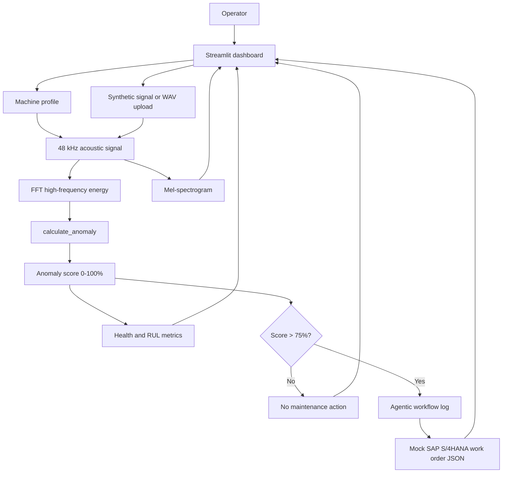
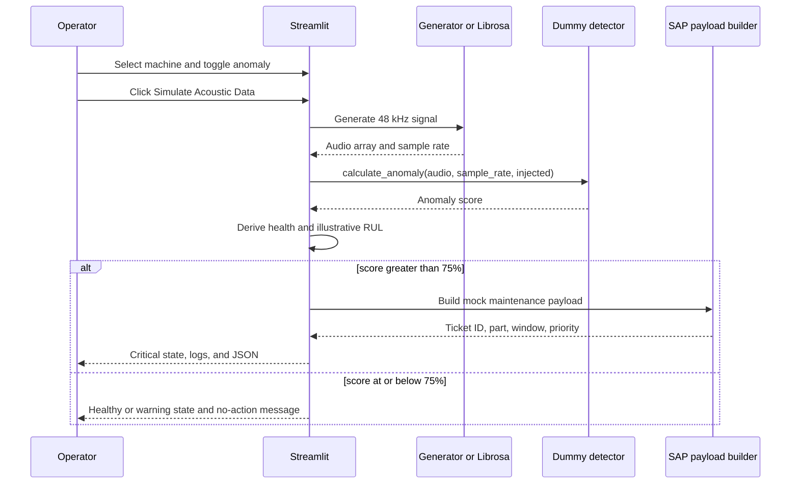
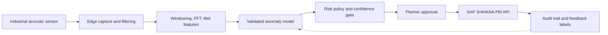

# Architecture and workflow

## System overview

The MVP is intentionally a single Python file. Streamlit reruns the script when a widget changes, while `st.session_state` keeps the most recent audio buffer and sample rate available for the current session.

## Event sequence

## Signal path

The simulator uses a 48 kHz sample rate because the Nyquist frequency is 24 kHz. That makes a synthetic component above 20 kHz representable:

\[
f_{Nyquist} = \frac{f_s}{2} = \frac{48,000}{2} = 24,000\text{ Hz}
\]

The generated signal is:

\[
x(t) = 0.20\sin(2\pi f t) + 0.08\sin(2\pi 3ft) + n(t) + a(t)
\]

where `n(t)` is white noise and `a(t)` is a sequence of short, damped 22 kHz bursts when anomaly injection is enabled.

## Decision logic

`calculate_anomaly` computes an FFT, averages spectral magnitude above 20 kHz, and adds a deterministic demo boost when the toggle is active. The score is clipped to 0–100%.

| Score | State | Agent behavior |
| ---: | --- | --- |
| 0–40% | Healthy | No maintenance action |
| >40–75% | Warning | Continue monitoring |
| >75% | Critical | Show simulated autonomous SAP workflow |

## Production evolution

