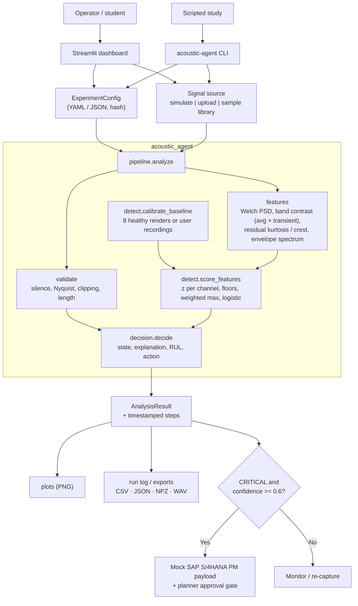
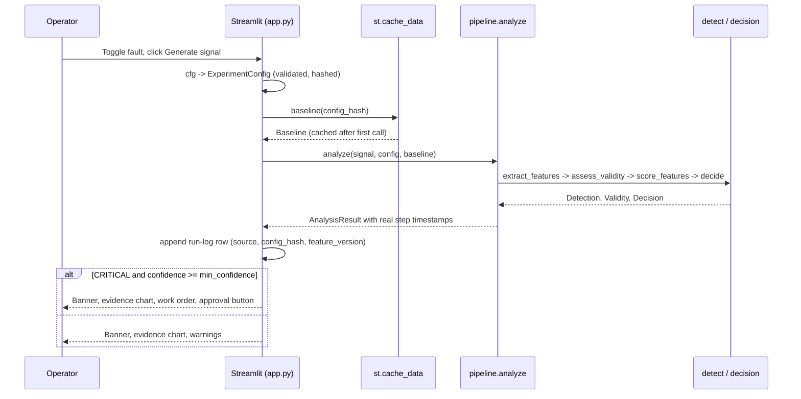
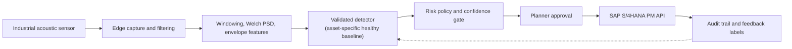

# Architecture and workflow

## System overview

The application is a UI-agnostic Python package (`acoustic_agent`) with two thin front-ends: the
Streamlit dashboard (`app.py`) and the `acoustic-agent` CLI. Streamlit reruns the script when a
widget changes; one canonical `st.session_state.cfg` dictionary holds the experiment
configuration so that values survive widgets being unmounted (for example when switching the
signal source), and `st.cache_data` memoises baseline calibration, feature extraction, plots and
sample decoding on `(config_hash, signal)`.



## Event sequence



## Signal path

The simulator uses a 48 kHz sample rate because the Nyquist frequency is 24 kHz, which makes a
component above 20 kHz representable:

\[
f_{Nyquist} = \frac{f_s}{2} = \frac{48\,000}{2} = 24\,000\ \text{Hz}
\]

The synthetic signal is

\[
x(t) = A\sin(2\pi f t) + 0.4A\sin(2\pi\,3f t) + n(t) + b(t) + i(t)
\]

where `n(t)` is white noise, `b(t)` is an optional train of short damped 22 kHz bursts
(micro-crack signature) and `i(t)` is an optional train of impacts at the ball-pass frequency of
the outer race (BPFO ≈ 107 Hz) that ring a 5.2 kHz structural resonance (bearing defect). The
two fault models are deliberately different: the first is visible above 20 kHz, the second only
in the impulsiveness of the residual and the envelope spectrum.

## Detection and decision logic

```text
z_c   = max(0, (x_c - mean_c) / max(std_c, floor_c))     per channel c
z     = max_c  w_c * z_c                                 strongest weighted channel
score = 100 / (1 + exp(-(z - z_center) / z_scale))       defaults: 3, 1
```

| Score | Confidence | State | Agent behaviour |
| ---: | --- | --- | --- |
| any | invalid input | `INVALID` | Check sensor / capture chain, no verdict |
| 0-40 % | – | `HEALTHY` | No maintenance action |
| >40-75 % | – | `WARNING` | Increase monitoring frequency |
| >75 % | ≥ 0.6 | `CRITICAL` | Propose P1 work order for planner approval |
| >75 % | < 0.6 | `CRITICAL (unconfirmed)` | Re-capture with valid rate / gain first |

Every result row and work-order payload carries the configuration hash and the
`FEATURE_VERSION` string so stored outputs remain comparable after the feature set changes.

## Quality gates

| Gate | Tool |
| --- | --- |
| Formatting and lint | `ruff format`, `ruff check` (pre-commit + CI) |
| Static types | `mypy --strict`-leaning configuration over `acoustic_agent`, `app.py`, `scripts` |
| Unit tests | `pytest` over every module, including gain-invariance, false-alarm and regression cases |
| UI smoke tests | Streamlit `AppTest` driving the sidebar and verifying the run log |
| Reproducibility | `scripts/generate_sample_wavs.py` must reproduce `data/samples` byte-for-byte |
| Dependencies | `uv.lock` for development, pinned `requirements.txt` for Streamlit Community Cloud |

## Production evolution


